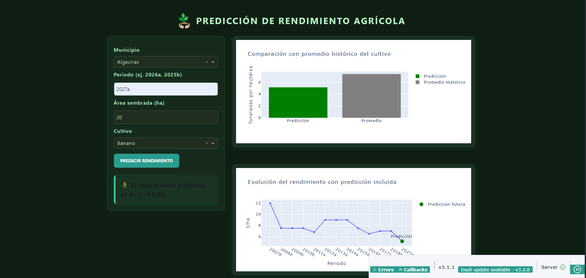

# Agricultura Inteligente: Predicción de Rendimiento Mediante Aprendizaje Profundo

Este proyecto implementa un sistema de predicción del rendimiento agrícola en el departamento del Huila, Colombia, utilizando **aprendizaje profundo** (redes neuronales) y análisis de datos climáticos. El trabajo combina información histórica de evaluaciones agropecuarias con datos climáticos satelitales de la NASA, integrados en un modelo multitarea capaz de proyectar rendimientos futuros.

---

## Objetivos

- Desarrollar un modelo de predicción de rendimiento agrícola a partir de variables climáticas y productivas.
- Implementar técnicas de limpieza y transformación de datos para unificar fuentes heterogéneas (Ministerio de Agricultura, Datos Abiertos Colombia, NASA POWER).
- Evaluar distintos enfoques de modelado, comparando algoritmos tradicionales (Random Forest) con redes neuronales.
- Construir una aplicación web interactiva en **Dash** para que los usuarios puedan realizar predicciones de forma sencilla.

---

## Contenido del repositorio

- **`Proyecto.ipynb`** → Notebook en Google Colab con todo el proceso de exploración, preprocesamiento, entrenamiento y validación del modelo.
- **`App.py`** → Aplicación en **Dash** que permite ingresar variables (municipio, periodo, cultivo, área sembrada) y obtener predicciones de rendimiento, con visualización gráfica.
- **`/assets/estilos.css`** → Estilos personalizados para la interfaz de la aplicación web.
- **`modelo_rendimiento_red.h5`** → Modelo final entrenado (red neuronal).
- **`preprocesador_red.pkl`** → Pipeline de preprocesamiento (transformaciones y codificaciones de variables).
- **`label_encoder_periodo.pkl`** → Codificador de periodos de siembra.
- **`df_completo.csv`** → Base de datos consolidada (rendimiento + clima).
- **`Informe_Proyecto.pdf`** → Informe técnico en normas APA.
- **`Presentación_Proyecto.pptx`** → Presentación ejecutiva del proyecto.

---

## Tecnologías utilizadas

- **Lenguaje principal:** Python 3.12  
- **Bibliotecas:**
  - Análisis y modelado: `pandas`, `numpy`, `scikit-learn`, `tensorflow/keras`
  - Visualización: `matplotlib`, `seaborn`, `plotly`
  - Web app: `dash`, `dash-bootstrap-components`
- **Fuentes de datos:**
  - Evaluaciones Agropecuarias Municipales (EVA) – Ministerio de Agricultura y Desarrollo Rural (vía [Datos Abiertos Colombia](https://www.datos.gov.co/))	
  - NASA POWER – Datos climáticos satelitales ([NASA POWER Data Access Viewer](https://power.larc.nasa.gov/data-access-viewer/))

---

## Resultados

- El modelo basado en **Random Forest** mostró un buen desempeño inicial pero con problemas de *data leakage* y limitaciones para escenarios futuros.
- Se desarrolló una **red neuronal multitarea** que predice simultáneamente condiciones climáticas y rendimiento agrícola:
  - Métricas obtenidas: R² ≈ 0.92, RMSE ≈ 1.38 t/ha
  - Mejor capacidad de generalización hacia períodos no observados.
- Se construyó una aplicación interactiva en **Dash**, que permite:
  - Ingresar municipio, periodo, cultivo y área sembrada.
  - Obtener predicciones de rendimiento.
  - Visualizar resultados en gráficos de tendencias, histogramas y mapas.

*Ejemplo de la interfaz de usuario:*

---

## Cómo ejecutar el proyecto

1. Clonar este repositorio:\
   git clone https://github.com/Juanjo0812/Prediccion_RendimientoCultivo.git\
   cd proyecto-agricultura-inteligente

2. Crear entorno virtual e instalar dependencias:\
  python -m venv venv\
  source venv/bin/activate   # En Linux/Mac\
  venv\Scripts\activate      # En Windows\
  pip install -r requirements.txt

3. Ejecutar la aplicación Dash:\
  python App.py

4. Abrir el navegador en http://127.0.0.1:8050/

## Autor

  *Juan Joseph Mora Estrada*\
  *Bootcamp IA Talento Tech – MINTIC* 

## Referencias

Ministerio de Agricultura y Desarrollo Rural. (s.f.). Evaluaciones Agropecuarias Municipales (EVA). Datos Abiertos Colombia.

  - https://www.datos.gov.co/Agricultura-y-Desarrollo-Rural/Evaluaciones-Agropecuarias-Municipales-EVA/2pnw-mmge/about_data
  - https://www.datos.gov.co/Agricultura-y-Desarrollo-Rural/Evaluaciones-Agropecuarias-Municipales-EVA-2019-20/uejq-wxrr/about_data

NASA POWER. (s.f.). NASA Prediction of Worldwide Energy Resources (POWER) Data Access Viewer.
  
  - https://power.larc.nasa.gov/data-access-viewer/
